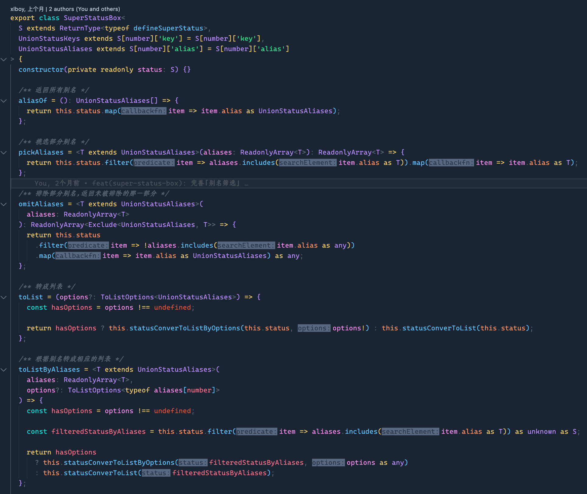

# 编辑器

## VSCodeVIM 二改

[二改地址](https://github.com/xlboy/Vim)、[原仓库地址](https://github.com/VSCodeVim/Vim)

已打包好的 `二改 VSCodeVIM 插件安装包` 文件位于 `./static` 中（文件名为 `vim-xlboy-0.0.0.vsix`）

---

## 字体

`中文字体` - `仓耳明楷 W05`

`英文字体` - `CascadiaCode`（微软专门为程序员而出的一款字体）

  

  	
效果图

  	
  

---

## 插件

图标 - [`Material Icon Theme`](https://marketplace.visualstudio.com/items?itemName=PKief.material-icon-theme)

主题 - [`Bearded Theme Arc`](https://marketplace.visualstudio.com/items?itemName=BeardedBear.beardedtheme)

路径提示 - [`Path Intellisense`](https://marketplace.visualstudio.com/items?itemName=christian-kohler.path-intellisense)

JS/TS 代码片段快速执行 - [`Quokka.js`](https://marketplace.visualstudio.com/items?itemName=WallabyJs.quokka-vscode)

内容选中高亮 - [`highlight-icemode`](https://marketplace.visualstudio.com/items?itemName=iceliu.highlight-icemode)

注释高亮 - [`Better Comments`](https://marketplace.visualstudio.com/items?itemName=aaron-bond.better-comments)

代码截图 - [`CodeSnap`](https://marketplace.visualstudio.com/items?itemName=adpyke.codesnap)

字体快速切换器 - [`Font Switcher`](https://marketplace.visualstudio.com/items?itemName=evan-buss.font-switcher)

灵活的翻译工具（穿梭在`注释`、`变量名` 等等内） - [`Comment Translate`]

EditorConfig - [`EditorConfig for VS Code`](https://marketplace.visualstudio.com/items?itemName=EditorConfig.EditorConfig)

文件修改后的缓存 - [`Local History`](https://marketplace.visualstudio.com/items?itemName=xyz.local-history)