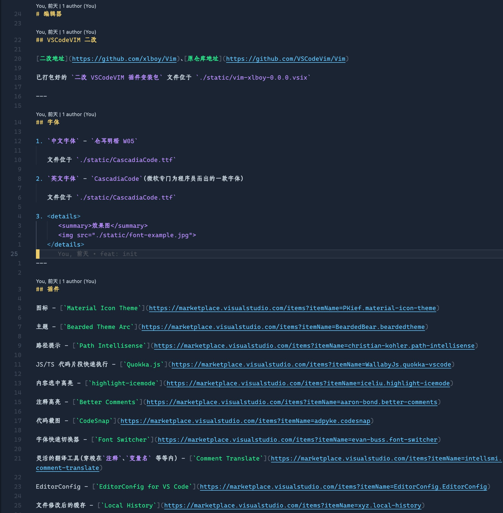

# 编辑器

## Neovim

1. [Neovim 下载地址](https://github.com/neovim/neovim)

2. [Plug 下载地址](https://github.com/junegunn/vim-plug)

3. 配置文件位于 `./nvim-config/` 中

## VSCode

<!-- ### VSCodeVIM 二改

[二改地址](https://github.com/xlboy/Vim)、[原仓库地址](https://github.com/VSCodeVim/Vim)

已打包好的 `二改 VSCodeVIM 插件安装包` 文件位于 `./static/vim-xlboy-0.0.0.vsix`

--- -->

### 插件

图标 - [`Material Icon Theme`](https://marketplace.visualstudio.com/items?itemName=PKief.material-icon-theme)

主题 - [`Bearded Theme Arc`](https://marketplace.visualstudio.com/items?itemName=BeardedBear.beardedtheme)

路径提示 - [`Path Intellisense`](https://marketplace.visualstudio.com/items?itemName=christian-kohler.path-intellisense)

JS/TS 代码片段快速执行 - [`Quokka.js`](https://marketplace.visualstudio.com/items?itemName=WallabyJs.quokka-vscode)

内容选中高亮 - [`highlight-icemode`](https://marketplace.visualstudio.com/items?itemName=iceliu.highlight-icemode)

注释高亮 - [`Better Comments`](https://marketplace.visualstudio.com/items?itemName=aaron-bond.better-comments)

代码截图 - [`CodeSnap`](https://marketplace.visualstudio.com/items?itemName=adpyke.codesnap)

字体快速切换器 - [`Font Switcher`](https://marketplace.visualstudio.com/items?itemName=evan-buss.font-switcher)

灵活的翻译工具（穿梭在`注释`、`变量名` 等等内） - [`Comment Translate`](https://marketplace.visualstudio.com/items?itemName=intellsmi.comment-translate)

EditorConfig - [`EditorConfig for VS Code`](https://marketplace.visualstudio.com/items?itemName=EditorConfig.EditorConfig)

文件修改后的缓存 - [`Local History`](https://marketplace.visualstudio.com/items?itemName=xyz.local-history)

在 TS 中显式的展示类型（TS-Playground 中的「双斜杠查询」支持） - [`vscode-twoslash-queries`](https://marketplace.visualstudio.com/items?itemName=Orta.vscode-twoslash-queries)

单词检查器 - [`Code Spell Checker`](https://marketplace.visualstudio.com/items?itemName=streetsidesoftware.code-spell-checker)

代码聚焦 - [`Focus`](https://marketplace.visualstudio.com/items?itemName=QuanLi.focus)

---

## 字体

1. `中文字体` - `仓耳明楷 W05`

   文件位于 `./static/CascadiaCode.ttf`

2. `英文字体` - `CascadiaCode`（微软专门为程序员而出的一款字体）

   文件位于 `./static/CascadiaCode.ttf`

3. 

   	
效果图

      

   	   
         

         
      

   

